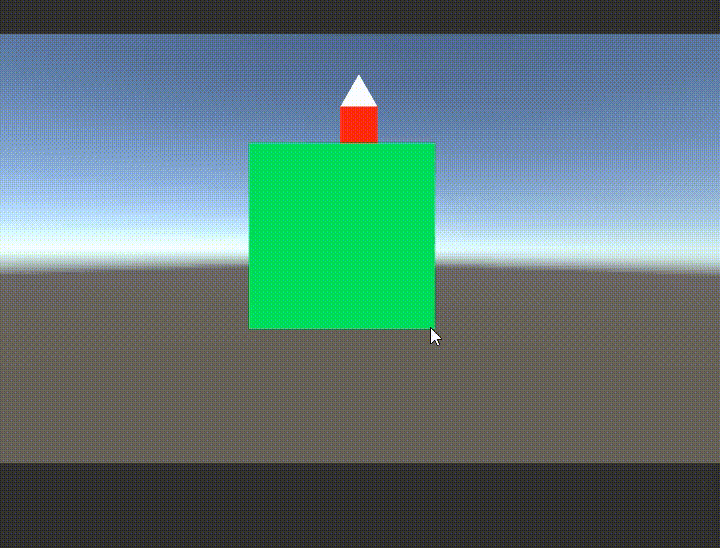
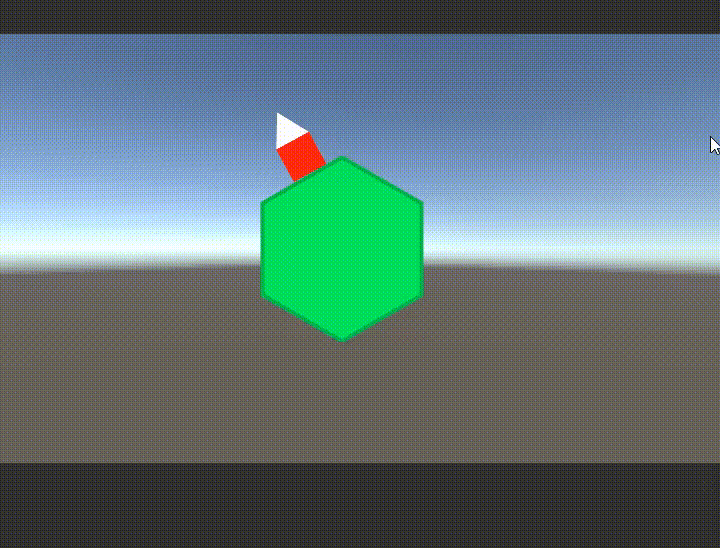
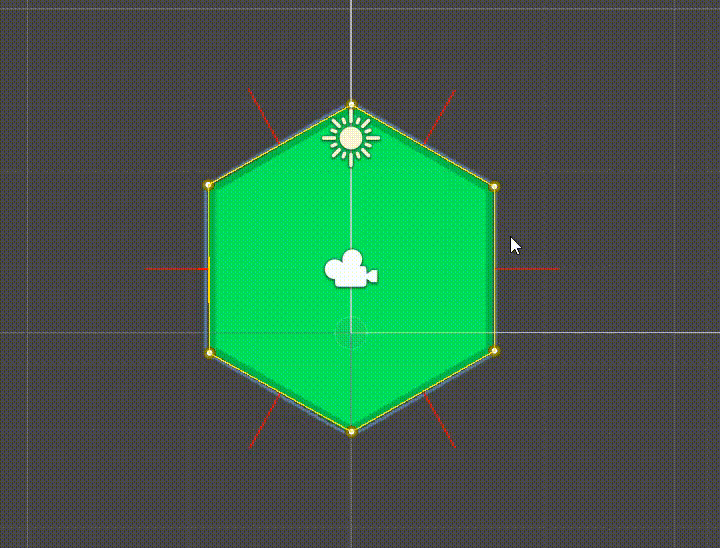

---

# 2D Game Prototype

Прототип 2D-игры с персонажем, который движется по граням платформы с «гравитацией» к поверхности, на которой он стоит, независимо от её ориентации..
Персонаж никогда не падает с платформы и всегда ориентирован по локальной поверхности.

---

## Функции

* Движение по любой грани платформы
* Прыжки от текущей поверхности
* Плавный переход через углы
* Поддержка произвольных платформ и их редактирования с помощью **CustomEditor** 

---

## Управление

### Desktop

| Клавиша | Действие |
| ------- | -------- |
| A / D   | Движение |
| Space   | Прыжок   |

### Mobile (Touch UI)

* Две кнопки движения
* Кнопка прыжка

---

## Запуск

1. Откройте сцену `MainScene`.
2. Запустите сцену.
3. Для отображения UI-управления установите флаг `Force Mobile Input` на объекте `EntryPoint`.

---

## Основные компоненты

### EntryPoint

* Точка входа сцены
* Инициализирует платформу и контроллер игрока
* Создаёт систему ввода через `InputFactory`
* Обновляет состояние ввода каждый кадр

### PlayerBehaviourController

* Основной скрипт управления персонажем
* Получает ввод и данные об активной поверхности
* Передаёт данные в `MovementCalculator`
* Обновляет позицию персонажа на основе расчетов

### MovementCalculator

* Рассчитывает физику движения персонажа
* Обрабатывает вертикальную скорость (падение / прыжок)
* Рассчитывает горизонтальное движение и поворот персонажа
* Использует данные о поверхности и пользовательский ввод

### SurfacesNavigator

* Обновляет данные о поверхности, на которой сейчас находится персонаж

### Platform

* Представляет многоугольную платформу в сцене
* Хранит вершины и создаёт поверхности (`PlatformSurface`) между ними
* Рассчитывает нормали и направления каждой грани
* Поддерживает произвольные многоугольники
* Визуализирует платформу и нормали в редакторе с помощью `Gizmos`

### PlatformEditor

* `Custom Editor` для компонента `Platform`
* Позволяет редактировать вершины платформы прямо в сцене Unity, перетаскивая их мышью
